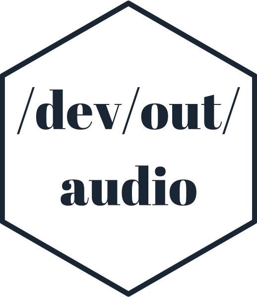

<!-- README.md is generated from README.Rmd. Please edit that file -->

```{r, include = FALSE}
knitr::opts_chunk$set(
  collapse = TRUE,
  comment = "#>",
  fig.path = "man/figures/README-",
  out.width = "70%"
)

library(devoutaudio)
library(ggplot2)
library(dplyr)
```


```{r echo = FALSE, eval = FALSE}
# Quick logo generation. Borrowed heavily from Nick Tierney's Syn logo process
library(magick)
library(showtext)
font_add_google("Abril Fatface", "gf")


# pkgdown::build_site(override = list(destination = "../coolbutuseless.github.io/package/devout"))
```


```{r echo = FALSE, eval = FALSE}
img <- image_read("man/figures/white.png")


hexSticker::sticker(subplot  = img,
                    s_x      = 0.92,
                    s_y      = 1,
                    s_width  = 1.5,
                    s_height = 0.95,
                    package  = "/dev/out/\naudio",
                    p_x      = 1,
                    p_y      = 1,
                    p_color  = "#223344",
                    p_family = "gf",
                    p_size   = 9,
                    h_size   = 1.2,
                    h_fill   = "#ffffff",
                    h_color  = "#223344",
                    filename = "man/figures/logo.png")

image_read("man/figures/logo.png")
```


# devoutaudio   

<!-- badges: start -->


<!-- badges: end -->

`devoutaudio` is an audio output "graphics" device - instead of rendering pixels, 
each graphics primitive is rendered as an audio snippet.

This is a testing ground for some graphics-to-sound ideas and is **very** experimental.

`devoutaudio` is written in plain R, and uses the 
[devout](https://github.com/coolbutuseless/devout) package to interface with the
R internals

### Point-to-sound mapping

* x position is mapped to audio channel position - points on the left of the plot
  are rendered mainly in the left channel of audio
* y position is mapped to frequency - the higher the point the higher the frequency
* size is mapped to duration - larger points have a longer sound


## Installation

You can install `devoutaudio` from [GitHub](https://github.com/coolbutuseless/devoutaudio) with:

``` r
# install.packages("devtools")
devtools::install_github("coolbutuseless/devout")
devtools::install_github("coolbutuseless/devoutaudio")
```


## Caveats

* This is a very experimental device.
* Only circles are currently mapped to a sound
* Audio is only played on-the-fly and there is no facility to save yet.


## Ideas

* currently just using `audio` package to generate some beeps, but there are 
  other more complex sound synthesis packages in R e.g. `seewave`, `soundgen`, 
  `tuneR`, `phonTools`
* Horizontal lines are sounds that move across the stereo landscape
* Vertical lines are a note of rising pitch
* Map line thickness to volume
* Text rendering = text-to-speech. Or generated phonemes with something like {soundgen}


# Examples

In the following examples:

* only audio is produced by the code show, but I've included the visual representation
  of the plots to assist in interpreting the audio
* because the audio is never saved to file, the audio was captured on-the-fly 
  from the MacOS sound output device

## Example 1


```{r example1, eval=FALSE}
library(devoutaudio)

audio()
plot(1:10)
dev.off()
```


### [Click to play audio rendering](https://github.com/coolbutuseless/devoutaudio/blob/master/man/figures/mp3/audio1.mp3?raw=true)

```{r graph1, echo = FALSE}
plot(1:10)
```


## Example 2


```{r example2, eval=FALSE}
plot_df <- mtcars %>% arrange(mpg)

audio()
ggplot(plot_df) +
  geom_point(aes(mpg, wt, size = cyl)) +
  theme(legend.position = 'none')
dev.off()
```

### [Click to play audio rendering](https://github.com/coolbutuseless/devoutaudio/blob/master/man/figures/mp3/audio2.mp3?raw=true)

```{r graph2, echo = FALSE}
plot_df <- mtcars %>% arrange(mpg)

ggplot(plot_df) +
  geom_point(aes(mpg, wt, size = cyl)) +
  theme(legend.position = 'none')
```


