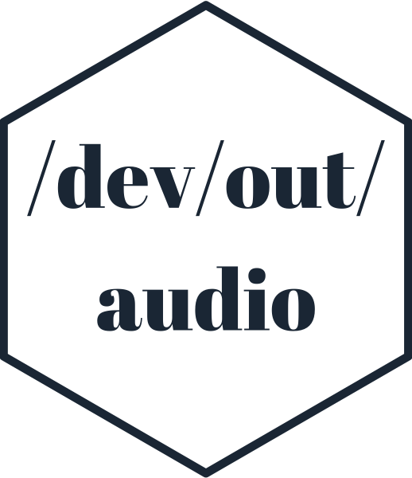

<!-- README.md is generated from README.Rmd. Please edit that file -->

# devoutaudio 

<!-- badges: start -->


<!-- badges: end -->

`devoutaudio` is an audio output “graphics” device - instead of
rendering pixels, each graphics primitive is rendered as an audio
snippet.

This is a testing ground for some graphics-to-sound ideas and is
**very** experimental.

`devoutaudio` is written in plain R, and uses the
[devout](https://github.com/coolbutuseless/devout) package to interface
with the R internals

### Point-to-sound mapping

  - x position is mapped to audio channel position - points on the left
    of the plot are rendered mainly in the left channel of audio
  - y position is mapped to frequency - the higher the point the higher
    the frequency
  - size is mapped to duration - larger points have a longer sound

## Installation

You can install `devoutaudio` from
[GitHub](https://github.com/coolbutuseless/devoutaudio) with:

``` r
# install.packages("devtools")
devtools::install_github("coolbutuseless/devout")
devtools::install_github("coolbutuseless/devoutaudio")
```

## Caveats

  - This is a very experimental device.
  - Only circles are currently mapped to a sound
  - Audio is only played on-the-fly and there is no facility to save
    yet.

# Examples

In the following examples:

  - only audio is produced by the code show, but I’ve included the
    visual representation of the plots to assist in interpreting the
    audio
  - because the audio is never saved to file, the audio was captured
    on-the-fly from the MacOS sound output device

## Example 1

``` r
library(devoutaudio)

audio()
plot(1:10)
dev.off()
```

### [Click to play audio rendering](https://github.com/coolbutuseless/devoutaudio-dev/blob/master/man/figures/mp3/audio1.mp3?raw=true)


## Example 2

``` r
plot_df <- mtcars %>% arrange(mpg)

audio()
ggplot(plot_df) +
  geom_point(aes(mpg, wt, size = cyl)) +
  theme(legend.position = 'none')
dev.off()
```

### [Click to play audio rendering](https://github.com/coolbutuseless/devoutaudio-dev/blob/master/man/figures/mp3/audio2.mp3?raw=true)


